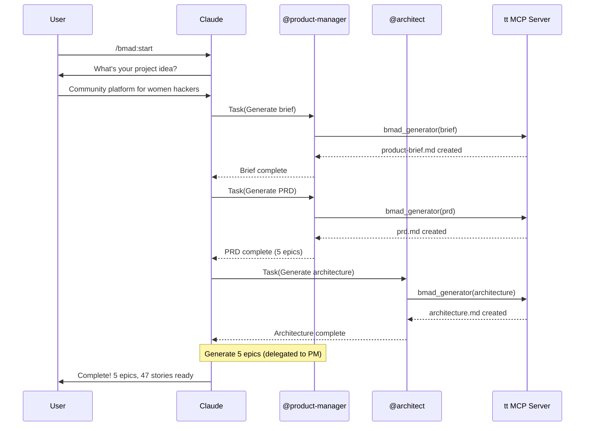

# Titanium Plugins

> Professional Claude Code plugins from Titanium Computing

A curated marketplace of Claude Code plugins designed for professional AI-powered development workflows.

## Available Plugins

### Titanium Toolkit

**Complete AI development orchestration system**

Transform Claude into an AI development team with 17 specialized agents, 10 comprehensive skills, and complete BMAD planning workflows.

**Key Features**:
- **17 Specialized Agents** - Each with deep domain expertise via skills
- **10 Comprehensive Skills** - 9,500+ lines of best practices
- **BMAD Methodology** - Complete project planning (Brief → PRD → Architecture → Epics)
- **Titanium Workflows** - Implementation orchestration (Plan → Work → Review)
- **Voice Announcements** - Real-time audio feedback via ElevenLabs
- **Pieces Integration** - Context recovery with `/catchup`

[→ Full Titanium Toolkit Documentation](./plugins/titanium-toolkit/README.md)

**Version**: 2.1.3

## Installation

### 1. Add This Marketplace

```bash
/plugin marketplace add webdevtodayjason/titanium-plugins
```

### 2. Install Titanium Toolkit

```bash
/plugin install titanium-toolkit@webdevtodayjason/titanium-plugins
```

### 3. Restart Claude Code

Close and reopen Claude Code to activate the plugin.

### 4. Verify Installation

```bash
# Check MCP servers loaded
/mcp
# Should see: plugin:titanium-toolkit:tt

# Check agents available
@api-developer
# Should show 17 agents

# Read orchestration guide
/titanium:orchestration-guide
```

## Prerequisites

### Required Software

- **Claude Code** 2.0.14 or later
- **Python** 3.11 or later
- **uv** (Python package manager) - [Install uv](https://docs.astral.sh/uv/)
- **Node.js** 20 or later (for MCP servers)

### Required API Keys

Create `~/.env` with:

```bash
# Required for BMAD document generation
ANTHROPIC_API_KEY=sk-ant-your-key-here

# Optional: Voice announcements
ELEVENLABS_API_KEY=sk_your-key-here

# Optional: Voice summaries
OPENAI_API_KEY=sk-proj-your-key-here
```

**Get API keys**:
- Anthropic: https://console.anthropic.com/settings/keys
- ElevenLabs: https://elevenlabs.io/app/settings/api-keys
- OpenAI: https://platform.openai.com/api-keys

### Recommended MCP Servers

```bash
# vibe-check - AI quality validation (highly recommended)
claude mcp add vibe-check --scope user --transport stdio -- npx -y @pv-bhat/vibe-check-mcp start --stdio

# Create ~/.vibe-check/.env with at least one key:
mkdir -p ~/.vibe-check
echo 'GEMINI_API_KEY=your-key-here' >> ~/.vibe-check/.env
```

**For vibe-check, add ONE of these** to `~/.vibe-check/.env`:
- `GEMINI_API_KEY` (recommended)
- `OPENAI_API_KEY`
- `OPENROUTER_API_KEY`

## Quick Start

### Generate Complete Project Documentation

```bash
/bmad:start
```

Creates:
- Product Brief
- PRD with epics and user stories
- Technical Architecture
- Epic files with acceptance criteria
- Story Index for sprint planning

**Duration**: 30-45 minutes | **Cost**: ~$0.15

### Implement Your First Epic

```bash
# 1. Create implementation plan
/titanium:plan bmad-backlog/epics/EPIC-001-foundation.md

# 2. Execute the plan
/titanium:work

# 3. Quality review
/titanium:review
```

**Duration**: 2-6 hours | **Cost**: ~$0.10 per epic

### Complete Workflow: Idea → Production Code

```
/bmad:start → /titanium:plan → /titanium:work → /titanium:review
  (45 min)        (2 min)         (4 hours)         (15 min)
```

**Total**: 1 day from idea to reviewed, tested code

## Documentation

- **[Titanium Toolkit README](./plugins/titanium-toolkit/README.md)** - Complete documentation
- **[Orchestration Guide](./plugins/titanium-toolkit/commands/titanium-orchestration-guide.md)** - How the system works
- **[Getting Started](./plugins/titanium-toolkit/commands/titanium-getting-started.md)** - Step-by-step tutorial
- **[Agent-Skills Mapping](./docs/AGENT_SKILLS_MAPPING.md)** - Which agents have which skills

## The Orchestration Model

Titanium Toolkit uses a **three-layer architecture**:

**Layer 1: Orchestrator (Claude)**
- Interprets slash commands
- Checks prerequisites
- Launches specialized subagents
- Coordinates workflow
- Presents results to user

**Layer 2: Subagents (Separate Context Windows)**
- 17 specialized agents with domain expertise
- Each has relevant skills (500-1000 line knowledge bases)
- Use MCP tools as instructed
- Validate their own work
- Store results in Pieces

**Layer 3: Tools & Knowledge**
- **MCP Tools**: tt server (plan_parser, bmad_generator, bmad_validator)
- **10 Skills**: api-best-practices, frontend-patterns, testing-strategy, security-checklist, code-quality-standards, devops-patterns, debugging-methodology, technical-writing, project-planning, bmad-methodology
- **Standard Tools**: Read, Write, Edit, Bash, Grep, Glob

## Example: BMAD Workflow



## For Plugin Developers

### Contributing New Plugins

1. Fork this repository
2. Create plugin in `plugins/your-plugin-name/`
3. Follow [Claude Code plugin structure](https://docs.claude.com/en/docs/claude-code/plugins)
4. Include comprehensive README
5. Test thoroughly
6. Submit pull request

### Plugin Structure

```
plugins/your-plugin-name/
├── .claude-plugin/
│   ├── plugin.json        # Metadata
│   └── mcp.json           # MCP servers (optional)
├── commands/              # Slash commands
├── agents/                # Specialized agents
├── skills/                # Domain knowledge
├── hooks/                 # Event hooks
└── README.md              # Documentation
```

## Support

- **Issues**: https://github.com/webdevtodayjason/titanium-plugins/issues
- **Discussions**: https://github.com/webdevtodayjason/titanium-plugins/discussions
- **Email**: jason@webdevtoday.com
- **Website**: [Titanium Computing](https://titaniumcomputing.com)

## Credits

**Created by**: Jason Brashear / Titanium Computing

**Built upon and inspired by**:
- **Anthropic** - Claude Code and Agent Skills architecture
- **Every's Compounding Engineering** - Agent delegation patterns and workflow methodology
- **BMAD-METHOD** - Breakthrough Method for Agile AI Driven Development framework
- **HOLACE Project** - Voice system architecture and ElevenLabs integration
- **Pieces for Developers** - Long-term memory and context recovery

**Special thanks to**:
- The Every team for pioneering AI workflow orchestration
- The BMAD community for comprehensive planning methodology
- Anthropic for Claude Code and MCP protocol
- All contributors to the Claude Code ecosystem

## License

MIT License

Copyright (c) 2025 Jason Brashear / Titanium Computing

See [LICENSE](LICENSE) file for details.
