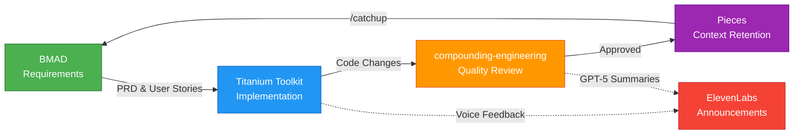
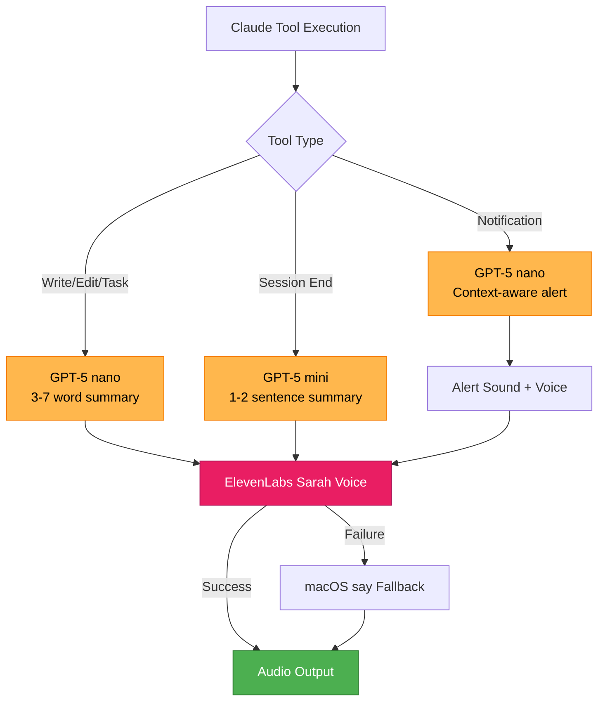

# Titanium Plugins

> Professional Claude Code plugins from Titanium Computing

## Overview

A curated marketplace of Claude Code plugins designed for professional development workflows. Features voice-enhanced AI assistance, comprehensive builder agents, and seamless context management.

## Available Plugins

### Titanium Toolkit

**Voice-enhanced development toolkit with 16 specialized agents**

The flagship plugin featuring:
- Real-time voice announcements via ElevenLabs
- 16 specialized builder agents for all development tasks
- Pieces LTM integration via `/catchup` command
- GPT-5 powered summaries and notifications

[→ Learn more about Titanium Toolkit](./plugins/titanium-toolkit/README.md)

**Installation:**
```bash
/plugin marketplace add webdevtodayjason/titanium-plugins
/plugin install titanium-toolkit
```

## Quick Start

### 1. Add the Marketplace

```bash
/plugin marketplace add webdevtodayjason/titanium-plugins
```

### 2. Browse Plugins

```bash
/plugin
```

Select "Browse Plugins" to see available options.

### 3. Install a Plugin

```bash
/plugin install titanium-toolkit
```

Restart Claude Code to activate.

## Complete Workflow

Titanium Toolkit integrates seamlessly with other development tools for a complete workflow:

### End-to-End Development Process

**Phase 1: Requirements & Planning (BMAD)**
```bash
# Install BMAD for PRD creation
cd ~
npx bmad-method install --directory ~/bmad --ide claude-code

# Use BMAD agents to create:
# - Product briefs
# - PRDs (Product Requirements Documents)
# - Epic breakdowns
# - User stories
```

**Phase 2: Implementation (Titanium Toolkit + compounding-engineering)**
```bash
# Execute the BMAD-generated PRD using compounding-engineering's /work command
/compounding-engineering:work ~/bmad/output/project-prd.md

# Titanium Toolkit's 16 builder agents handle implementation:
# - @api-developer creates backend
# - @frontend-developer builds UI
# - @test-runner ensures quality
# - Voice announcements keep you informed throughout
```

**Phase 3: Review & Quality (compounding-engineering)**
```bash
# Multi-agent parallel review
/compounding-engineering:review

# Specialized reviewers check:
# - @kieran-rails-reviewer (Rails conventions)
# - @security-sentinel (security vulnerabilities)
# - @performance-oracle (performance issues)
# - @architecture-strategist (system design)
```

**Phase 4: Iteration & Learning (Pieces + Voice)**
```bash
# Pieces captures all learnings
# Voice summaries on session end
# /catchup retrieves context for next session
```

### Workflow Benefits

**Complete Coverage:**
- BMAD → Requirements
- Titanium Toolkit → Implementation
- compounding-engineering → Quality Review
- Pieces → Context Retention



**Voice-Enhanced:**
- Real-time feedback during implementation
- Session summaries of accomplishments
- Smart notifications when input needed

**Context-Aware:**
- `/catchup` recovers project state
- Pieces LTM remembers everything
- Never lose track of work in progress

## Plugin Features

### Voice System

All plugins in this marketplace feature intelligent voice feedback:

- **ElevenLabs Integration**: High-quality "Sarah" voice
- **GPT-5 Summaries**: Context-aware announcements
- **Smart Notifications**: Know exactly what Claude needs



### Builder Agents

16 specialized agents organized by function:

```mermaid
graph TB
    subgraph Development["🛠️ Development (3)"]
        D1[@api-developer]
        D2[@frontend-developer]
        D3[@devops-engineer]
    end

    subgraph Quality["✅ Quality & Testing (4)"]
        Q1[@code-reviewer]
        Q2[@debugger]
        Q3[@test-runner]
        Q4[@tdd-specialist]
        Q5[@security-scanner]
    end

    subgraph Documentation["📝 Documentation (2)"]
        DC1[@doc-writer]
        DC2[@api-documenter]
    end

    subgraph Planning["📋 Planning & Architecture (3)"]
        P1[@product-manager]
        P2[@project-planner]
        P3[@meta-agent]
    end

    subgraph Specialized["⚡ Specialized (3)"]
        S1[@refactor]
        S2[@marketing-writer]
        S3[@shadcn-ui-builder]
    end

    style Development fill:#2196F3,stroke:#1565C0,color:#fff
    style Quality fill:#4CAF50,stroke:#2E7D32,color:#fff
    style Documentation fill:#FF9800,stroke:#E65100,color:#fff
    style Planning fill:#9C27B0,stroke:#6A1B9A,color:#fff
    style Specialized fill:#00BCD4,stroke:#00838F,color:#fff
```

Access any agent via `@agent-name` mention

### Context Management

**Pieces Integration:**
- `/catchup` command for instant context recovery
- Query your workflow history
- Resume work seamlessly

## Requirements

### Software

- Claude Code 2.0.14+
- Python 3.11+
- uv (Python package manager)
- Node.js 20+

### API Keys

Required for voice features:
- OpenAI API key (GPT-5 models)
- ElevenLabs API key (voice synthesis)

### Recommended MCP Servers

The Titanium Toolkit works best with these MCP servers configured:

#### 1. **Pieces** (Required for /catchup)
**Purpose**: Long-term memory and workflow context
**Source**: https://pieces.app
```bash
pip3 install --upgrade pieces-cli
pieces mcp setup claude_code --stdio
```

#### 2. **shadcn-ui-server**
**Purpose**: UI component library integration
**Source**: https://github.com/heilgar/shadcn-ui-mcp-server
```bash
claude mcp add shadcn-ui-server --scope user --transport stdio -- npx @heilgar/shadcn-ui-mcp-server
```

#### 3. **vibe-check**
**Purpose**: Meta-mentor AI oversight, prevents tunnel vision
**Source**: https://github.com/PV-Bhat/vibe-check-mcp-server
```bash
npm install -g @pv-bhat/vibe-check-mcp
# Configure API keys in ~/.vibe-check/.env
```

#### 4. **playwright**
**Purpose**: Browser automation and testing
**Source**: https://github.com/microsoft/playwright
```bash
claude mcp add playwright --scope user --transport stdio -- npx @playwright/mcp@latest
```

#### 5. **ElevenLabs MCP**
**Purpose**: Text-to-speech via MCP tools
**Source**: https://elevenlabs.io
```bash
claude mcp add ElevenLabs --scope user --transport stdio --env ELEVENLABS_API_KEY=your_key -- uvx elevenlabs-mcp@latest
```

#### 6. **context7**
**Purpose**: Up-to-date library documentation
**Source**: https://context7.com
```bash
claude mcp add context7 --scope user --transport http --header "CONTEXT7_API_KEY: your_key" -- https://mcp.context7.com/mcp
```

#### 7. **pypi**
**Purpose**: Python package queries and information
**Source**: https://github.com/loonghao/pypi-query-mcp-server
```bash
claude mcp add pypi --scope user --transport stdio -- uvx pypi-query-mcp-server
```

#### 8. **youtube-transcript**
**Purpose**: Extract transcripts from YouTube videos
**Source**: https://github.com/jkawamoto/mcp-youtube-transcript
```bash
claude mcp add youtube-transcript --scope user --transport stdio -- uvx --from git+https://github.com/jkawamoto/mcp-youtube-transcript mcp-youtube-transcript
```

**Verify MCP servers:**
```bash
claude mcp list
```

All should show ✓ Connected.

## Contributing

Want to contribute a plugin to this marketplace?

1. Fork this repository
2. Create your plugin in `plugins/your-plugin-name/`
3. Follow the [plugin structure guidelines](https://docs.claude.com/en/docs/claude-code/plugins)
4. Submit a pull request

## Support

- **Issues**: https://github.com/webdevtodayjason/titanium-plugins/issues
- **Discussions**: https://github.com/webdevtodayjason/titanium-plugins/discussions
- **Company**: [Titanium Computing](https://titaniumcomputing.com)

## Credits

Created by Jason Brashear (Titanium Computing)

**Built upon amazing work from:**
- [Every's Compounding Engineering](https://github.com/EveryInc/every-marketplace) - Workflow patterns and methodology
- [BMAD-METHOD](https://github.com/bmad-code-org/BMAD-METHOD) - Planning and requirements framework

Special thanks to the Claude Code team at Anthropic for building an incredible platform.

## License

MIT License - See individual plugin directories for specific license terms.
