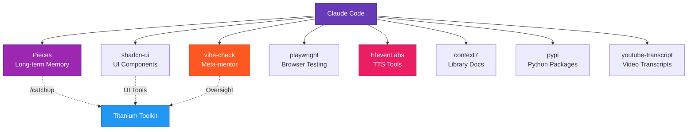

# Titanium Plugins

> Professional Claude Code plugins from Titanium Computing

## Overview

A curated marketplace of Claude Code plugins designed for professional development workflows. Features voice-enhanced AI assistance, comprehensive builder agents, and seamless context management.

## Prerequisites

Before using Titanium Toolkit, you'll need these installed:

### Required Software

- **Claude Code** 2.0.14+
- **Python** 3.11+ (for voice hooks)
- **uv** (Python package manager) - https://docs.astral.sh/uv/
- **Node.js** 20+ (for MCP servers)

### Required API Keys

Create a file at `~/.env` (full path: `/Users/yourusername/.env`):

```bash
# Create the file
cat > ~/.env << 'EOF'
# Required for voice announcements
OPENAI_API_KEY=your_openai_key_here
ELEVENLABS_API_KEY=your_elevenlabs_key_here
EOF

# Secure the file
chmod 600 ~/.env
```

Replace `your_openai_key_here` and `your_elevenlabs_key_here` with your actual API keys.

### MCP Server Prerequisites

Each MCP server requires its underlying application to be installed:

| MCP Server | Required Application | Installation |
|------------|---------------------|--------------|
| **Pieces** | Pieces OS + Pieces CLI | Download from https://pieces.app |
| vibe-check | Node.js 20+ | `npm install -g @pv-bhat/vibe-check-mcp` |
| playwright | Node.js 20+ | Installed via npx automatically |
| ElevenLabs | Python + uv | Installed via uvx automatically |
| pypi | Python + uv | Installed via uvx automatically |
| youtube-transcript | Python + uv | Installed via uvx automatically |
| shadcn-ui | Node.js 20+ | Installed via npx automatically |
| context7 | None (HTTP) | Just needs API key |

📖 **[Detailed Pieces Installation Guide](./docs/PIECES_INSTALLATION.md)** - Step-by-step for all platforms

## Available Plugins

### Titanium Toolkit

**Voice-enhanced development toolkit with 16 specialized agents**

The flagship plugin featuring:
- Real-time voice announcements via ElevenLabs
- 16 specialized builder agents for all development tasks
- Pieces LTM integration via `/catchup` command
- GPT-5 powered summaries and notifications

[→ Learn more about Titanium Toolkit](./plugins/titanium-toolkit/README.md)

**Installation:**
```bash
/plugin marketplace add webdevtodayjason/titanium-plugins
/plugin install titanium-toolkit
```

## Quick Start

### 1. Add the Marketplace

```bash
/plugin marketplace add webdevtodayjason/titanium-plugins
```

### 2. Browse Plugins

```bash
/plugin
```

Select "Browse Plugins" to see available options.

### 3. Install a Plugin

```bash
/plugin install titanium-toolkit
```

Restart Claude Code to activate.

## Complete Workflow

Titanium Toolkit integrates seamlessly with other development tools for a complete workflow:

### End-to-End Development Process

**Phase 1: Requirements & Planning (BMAD)**
```bash
# Install BMAD for PRD creation
cd ~
npx bmad-method install --directory ~/bmad --ide claude-code

# Use BMAD agents to create:
# - Product briefs
# - PRDs (Product Requirements Documents)
# - Epic breakdowns
# - User stories
```

📖 **[BMAD Quick Start Guide](./docs/BMAD_QUICKSTART.md)** - Complete guide to creating PRDs with BMAD

**Phase 2: Implementation (Titanium Toolkit + compounding-engineering)**
```bash
# Execute the BMAD-generated PRD using compounding-engineering's /work command
/compounding-engineering:work ~/bmad/output/project-prd.md

# Titanium Toolkit's 16 builder agents handle implementation:
# - @api-developer creates backend
# - @frontend-developer builds UI
# - @test-runner ensures quality
# - Voice announcements keep you informed throughout
```

**Phase 3: Review & Quality (compounding-engineering)**
```bash
# Multi-agent parallel review
/compounding-engineering:review

# Specialized reviewers check:
# - @kieran-rails-reviewer (Rails conventions)
# - @security-sentinel (security vulnerabilities)
# - @performance-oracle (performance issues)
# - @architecture-strategist (system design)
```

**Phase 4: Iteration & Learning (Pieces + Voice)**
```bash
# Pieces captures all learnings
# Voice summaries on session end
# /catchup retrieves context for next session
```

### Workflow Benefits

**Complete Coverage:**
- BMAD → Requirements
- Titanium Toolkit → Implementation
- compounding-engineering → Quality Review
- Pieces → Context Retention


**Voice-Enhanced:**
- Real-time feedback during implementation
- Session summaries of accomplishments
- Smart notifications when input needed

**Context-Aware:**
- `/catchup` recovers project state
- Pieces LTM remembers everything
- Never lose track of work in progress

## Plugin Features

### Voice System

All plugins in this marketplace feature intelligent voice feedback:

- **ElevenLabs Integration**: High-quality "Sarah" voice
- **GPT-5 Summaries**: Context-aware announcements
- **Smart Notifications**: Know exactly what Claude needs


### Builder Agents

16 specialized agents organized by function:

**Development (3 agents):**
- @api-developer - Backend API development
- @frontend-developer - Modern frontend development
- @devops-engineer - CI/CD and deployment

**Quality & Testing (5 agents):**
- @code-reviewer - Code review specialist
- @debugger - Error analysis
- @test-runner - Automated testing
- @tdd-specialist - Test-driven development
- @security-scanner - Security vulnerabilities

**Documentation (2 agents):**
- @doc-writer - Technical documentation
- @api-documenter - API docs (OpenAPI/Swagger)

**Planning & Architecture (3 agents):**
- @product-manager - Requirements gathering
- @project-planner - Project breakdown
- @meta-agent - Creates new custom agents

**Specialized (3 agents):**
- @refactor - Code refactoring
- @marketing-writer - Marketing content
- @shadcn-ui-builder - UI/UX with shadcn

Access any agent via `@agent-name` mention

### Reviewer Agents (from compounding-engineering)

When you install compounding-engineering alongside titanium-toolkit, you get 17 additional specialized review agents:

**Code Review (3 agents):**
- @kieran-rails-reviewer - Strict Rails conventions and best practices
- @kieran-python-reviewer - Strict Python conventions
- @kieran-typescript-reviewer - Strict TypeScript conventions

**Quality & Security (4 agents):**
- @security-sentinel - Security vulnerability scanning
- @code-simplicity-reviewer - Identifies overcomplicated code
- @data-integrity-guardian - Database and data validation
- @pattern-recognition-specialist - Design patterns and anti-patterns

**Architecture & Performance (3 agents):**
- @architecture-strategist - System design decisions
- @performance-oracle - Performance optimization
- @every-style-editor - Every.to style guide compliance

**Research & Analysis (4 agents):**
- @best-practices-researcher - Gathers external best practices
- @framework-docs-researcher - Library and framework documentation
- @git-history-analyzer - Code evolution and archeology
- @repo-research-analyst - Repository structure analysis

**Workflow Support (3 agents):**
- @pr-comment-resolver - Addresses PR feedback
- @feedback-codifier - Learns from review patterns
- @dhh-rails-reviewer - Rails review from DHH's perspective

**Total: 33 agents** (16 builders + 17 reviewers) = Complete development pipeline

### Context Management

**Pieces Integration:**
- `/catchup` command for instant context recovery
- Query your workflow history
- Resume work seamlessly

## Requirements

### Software

- Claude Code 2.0.14+
- Python 3.11+
- uv (Python package manager)
- Node.js 20+

### API Keys

Required for voice features:
- OpenAI API key (GPT-5 models)
- ElevenLabs API key (voice synthesis)

### Recommended MCP Servers

The Titanium Toolkit works best with these MCP servers configured.

**IMPORTANT**: Each MCP server requires its underlying application/service to be installed and running:

| MCP Server | Required Application | Installation |
|------------|---------------------|--------------|
| Pieces | Pieces OS + Pieces CLI | Download from https://pieces.app |
| vibe-check | Node.js 20+ | `npm install -g @pv-bhat/vibe-check-mcp` |
| playwright | Node.js 20+ | Installed via npx automatically |
| ElevenLabs | Python + uv | Installed via uvx automatically |
| pypi | Python + uv | Installed via uvx automatically |
| youtube-transcript | Python + uv | Installed via uvx automatically |
| shadcn-ui | Node.js 20+ | Installed via npx automatically |
| context7 | None (HTTP) | Just needs API key |



#### 1. **Pieces** (Required for /catchup)
**Purpose**: Long-term memory and workflow context
**Source**: https://pieces.app

**Prerequisites:**
1. Download and install Pieces OS: https://pieces.app
2. Install Pieces CLI:
   ```bash
   pip3 install --upgrade pieces-cli
   ```
3. Ensure Pieces OS is running (launch the Desktop app)
4. Enable LTM in Pieces settings

**Setup:**
```bash
pieces mcp setup claude_code --stdio
```

Verify: `claude mcp list` should show "Pieces: ✓ Connected"

#### 2. **shadcn-ui-server**
**Purpose**: UI component library integration
**Source**: https://github.com/heilgar/shadcn-ui-mcp-server
```bash
claude mcp add shadcn-ui-server --scope user --transport stdio -- npx @heilgar/shadcn-ui-mcp-server
```

#### 3. **vibe-check**
**Purpose**: Meta-mentor AI oversight, prevents tunnel vision
**Source**: https://github.com/PV-Bhat/vibe-check-mcp-server
```bash
npm install -g @pv-bhat/vibe-check-mcp
# Configure API keys in ~/.vibe-check/.env
```

#### 4. **playwright**
**Purpose**: Browser automation and testing
**Source**: https://github.com/microsoft/playwright
```bash
claude mcp add playwright --scope user --transport stdio -- npx @playwright/mcp@latest
```

#### 5. **ElevenLabs MCP**
**Purpose**: Text-to-speech via MCP tools
**Source**: https://elevenlabs.io
```bash
claude mcp add ElevenLabs --scope user --transport stdio --env ELEVENLABS_API_KEY=your_key -- uvx elevenlabs-mcp@latest
```

#### 6. **context7**
**Purpose**: Up-to-date library documentation
**Source**: https://context7.com
```bash
claude mcp add context7 --scope user --transport http --header "CONTEXT7_API_KEY: your_key" -- https://mcp.context7.com/mcp
```

#### 7. **pypi**
**Purpose**: Python package queries and information
**Source**: https://github.com/loonghao/pypi-query-mcp-server
```bash
claude mcp add pypi --scope user --transport stdio -- uvx pypi-query-mcp-server
```

#### 8. **youtube-transcript**
**Purpose**: Extract transcripts from YouTube videos
**Source**: https://github.com/jkawamoto/mcp-youtube-transcript
```bash
claude mcp add youtube-transcript --scope user --transport stdio -- uvx --from git+https://github.com/jkawamoto/mcp-youtube-transcript mcp-youtube-transcript
```

**Verify MCP servers:**
```bash
claude mcp list
```

All should show ✓ Connected.

## For Different Audiences

### For Marketplace Users

**Discover and use plugins:**
- Browse the marketplace with `/plugin`
- Install titanium-toolkit for voice-enhanced development
- Test features before committing to workflows
- Report issues and suggest improvements

**Share with your team:**
- Help colleagues discover voice announcements
- Set up team-wide installations
- Share workflows that leverage the toolkit

### For Plugin Developers

**Contribute to this marketplace:**
1. Fork this repository
2. Create your plugin in `plugins/your-plugin-name/`
3. Follow the [plugin structure guidelines](https://docs.claude.com/en/docs/claude-code/plugins)
4. Include comprehensive README with:
   - Prerequisites and dependencies
   - API key requirements
   - Installation instructions
   - Usage examples
5. Submit a pull request

**Best practices:**
- Use semantic versioning
- Document all dependencies
- Never commit API keys
- Test thoroughly before submitting
- Provide clear usage examples

### For Organizations

**Private deployment:**
- Fork titanium-plugins for internal use
- Customize agents for your tech stack
- Add company-specific voice preferences
- Configure team-wide MCP servers

**Governance:**
- Establish plugin approval process
- Review API key management policies
- Set up internal marketplace for approved plugins
- Create training materials for voice system adoption

**Team rollout:**
- Start with `/catchup` for context management
- Gradually introduce voice announcements
- Train on builder agents for common tasks
- Monitor usage and gather feedback

## Support

- **Issues**: https://github.com/webdevtodayjason/titanium-plugins/issues
- **Discussions**: https://github.com/webdevtodayjason/titanium-plugins/discussions
- **Company**: [Titanium Computing](https://titaniumcomputing.com)
- **Discord**: Join [Claude Developers Discord](https://anthropic.com/discord)

## Credits

Created by Jason Brashear (Titanium Computing)

**Built upon amazing work from:**
- [Every's Compounding Engineering](https://github.com/EveryInc/every-marketplace) - Workflow patterns and methodology
- [BMAD-METHOD](https://github.com/bmad-code-org/BMAD-METHOD) - Planning and requirements framework

Special thanks to the Claude Code team at Anthropic for building an incredible platform.

## License

MIT License - See individual plugin directories for specific license terms.
