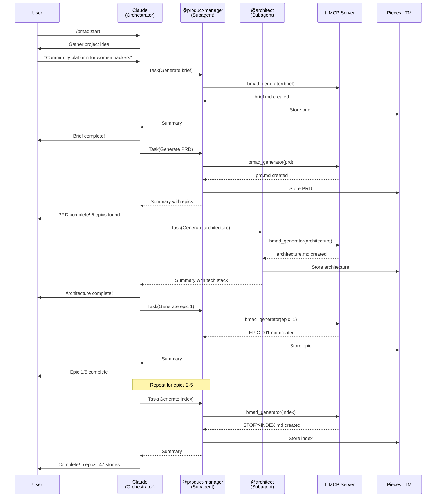
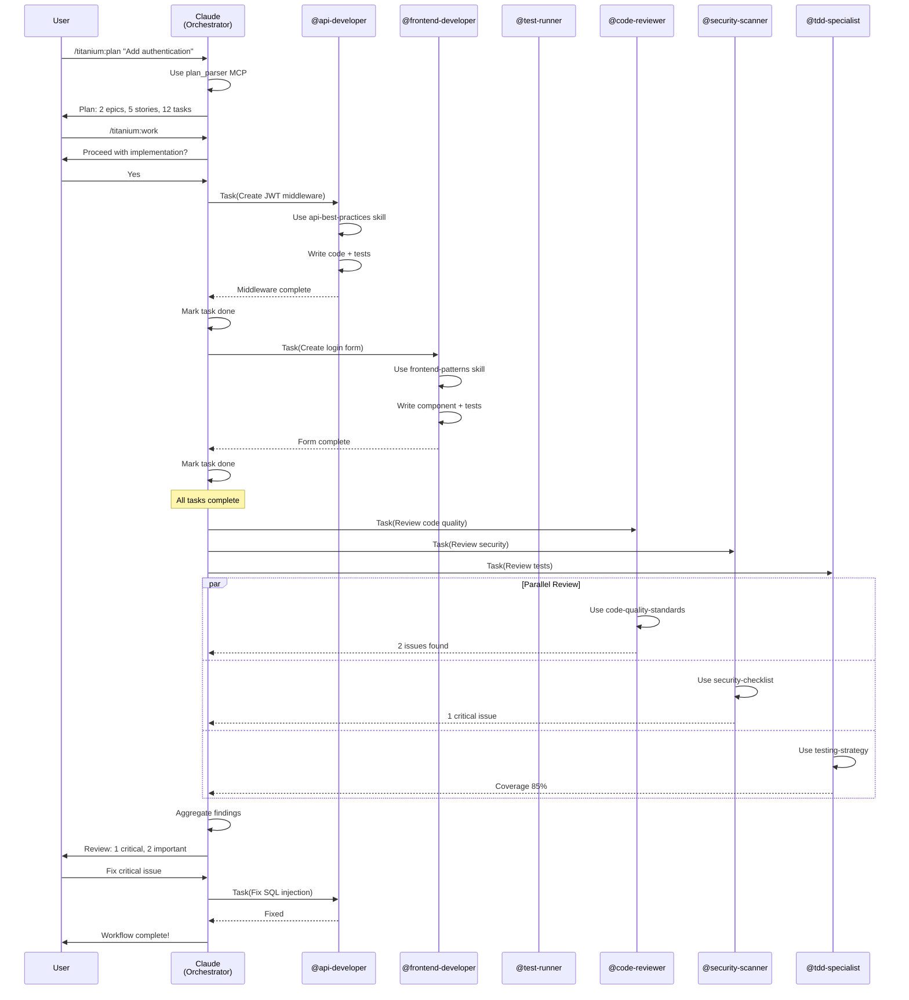

# Titanium Toolkit

> AI-powered development orchestration system for Claude Code

Transform Claude into an AI development team with 17 specialized agents, 10 skill domains, and comprehensive BMAD planning workflows.

## What Is Titanium Toolkit?

Titanium Toolkit is a Claude Code plugin that enables **orchestrated AI development** through:

- **17 Specialized Agents** - Each with deep domain expertise via skills
- **10 Comprehensive Skills** - 9,500+ lines of best practices and patterns
- **BMAD Methodology** - Complete project planning (Brief → PRD → Architecture → Epics)
- **Titanium Workflows** - Implementation orchestration (Plan → Work → Review)
- **Voice Announcements** - Real-time audio feedback via ElevenLabs
- **Pieces Integration** - Context recovery with `/catchup`

**Orchestration Model**: You (Claude) don't write code or documents directly. Instead, you delegate to specialized subagents who work in separate context windows with access to relevant skills and MCP tools.

## Prerequisites

### Required Software

- **Claude Code** 2.0.14 or later
- **Python** 3.11 or later
- **uv** (Python package manager) - [Install uv](https://docs.astral.sh/uv/)
- **Node.js** 20 or later (for MCP servers)

### Required API Keys

Create `~/.env` with:

```bash
# Required for BMAD document generation
ANTHROPIC_API_KEY=sk-ant-your-key-here

# Optional: Voice announcements
ELEVENLABS_API_KEY=sk_your-key-here

# Optional: Voice summaries
OPENAI_API_KEY=sk-proj-your-key-here
```

Get API keys:
- Anthropic: https://console.anthropic.com/settings/keys
- ElevenLabs: https://elevenlabs.io/app/settings/api-keys
- OpenAI: https://platform.openai.com/api-keys

## Installation

### 1. Add Marketplace

```bash
/plugin marketplace add webdevtodayjason/titanium-plugins
```

### 2. Install Plugin

```bash
/plugin install titanium-toolkit@webdevtodayjason/titanium-plugins
```

### 3. Restart Claude Code

Close and reopen Claude Code to activate the plugin.

### 4. Verify Installation

```bash
# Check MCP servers loaded (should see "plugin:titanium-toolkit:tt")
/mcp

# Check agents available (should show 17 agents)
@api-developer

# Test voice system (should hear announcement - if voice keys configured)
# Use any Write or Edit tool
```

## Setup

### Environment Configuration

1. **Create ~/.env file** (if it doesn't exist):
   ```bash
   touch ~/.env
   chmod 600 ~/.env
   ```

2. **Add required API key**:
   ```bash
   echo 'ANTHROPIC_API_KEY=sk-ant-your-key-here' >> ~/.env
   ```

3. **Add optional keys** (for voice features):
   ```bash
   echo 'ELEVENLABS_API_KEY=sk_your-key-here' >> ~/.env
   echo 'OPENAI_API_KEY=sk-proj-your-key-here' >> ~/.env
   ```

4. **Restart Claude Code** to load environment variables.

### Optional: Install Recommended MCP Servers

```bash
# vibe-check - AI quality validation (highly recommended)
claude mcp add vibe-check --scope user --transport stdio -- npx -y @pv-bhat/vibe-check-mcp start --stdio

# Pieces - Context recovery with /catchup
# Requires Pieces OS running: https://pieces.app
pip3 install --upgrade pieces-cli

# Playwright - Browser automation
claude mcp add playwright --scope user --transport stdio -- npx @playwright/mcp@latest

# PyPI - Python package information
claude mcp add pypi --scope user --transport stdio -- uvx pypi-query-mcp-server
```

For vibe-check, also create `~/.vibe-check/.env`:
```bash
mkdir -p ~/.vibe-check
echo 'GEMINI_API_KEY=your-key-here' >> ~/.vibe-check/.env
# OR use OPENAI_API_KEY or OPENROUTER_API_KEY
```

## Quick Start

### Understanding the Orchestration Model

**Read this first**: `/titanium:orchestration-guide`

Titanium Toolkit works through **orchestration**:
- **You (Claude)** = Orchestrator - coordinates work, doesn't do it
- **Subagents** = Specialists - perform tasks in separate context windows
- **Skills** = Domain knowledge - provide expertise to subagents
- **MCP Tools** = Shared utilities - used by subagents

### Your First BMAD Workflow (Planning)

Generate complete project documentation from an idea:

```bash
/bmad:start
```

This creates:
- Product Brief (vision and goals)
- PRD (requirements, epics, user stories)
- Architecture (tech stack, database design, infrastructure)
- Epic files (detailed stories with acceptance criteria)
- Story Index (summary for sprint planning)

**Duration**: 30-45 minutes
**Cost**: ~$0.15 (Claude API usage)

### Your First Implementation Workflow

Turn a BMAD epic into working code:

```bash
# 1. Create implementation plan
/titanium:plan bmad-backlog/epics/EPIC-001-foundation.md

# 2. Review plan, then execute
/titanium:work

# 3. Quality review
/titanium:review
```

**Duration**: 2-6 hours (depends on epic size)
**Cost**: ~$0.10 per epic

## How to Start a Project

### Complete Workflow: Idea → Working Code

**Phase 1: Planning (BMAD)**

```bash
# Generate complete project backlog
/bmad:start
```

You'll be guided through:
1. Describing your project idea
2. Answering clarifying questions
3. Reviewing generated documents
4. Approving epic structure

**Output**: `bmad-backlog/` folder with all documentation

**Phase 2: Implementation (Titanium)**

```bash
# Plan first epic
/titanium:plan bmad-backlog/epics/EPIC-001-foundation.md

# Implement the plan
/titanium:work

# Review the code
/titanium:review
```

**Output**: Working code with tests, reviewed by 3 quality agents

**Phase 3: Iterate**

```bash
# Plan next epic
/titanium:plan bmad-backlog/epics/EPIC-002-core-features.md

# Implement
/titanium:work

# Review
/titanium:review
```

Repeat until all epics complete!

## Available Commands

### BMAD Commands (Planning & Documentation)

| Command | Purpose | Delegates To |
|---------|---------|-------------|
| `/bmad:start` | Complete backlog generation | @product-manager, @architect |
| `/bmad:brief` | Generate product brief | @product-manager |
| `/bmad:prd` | Generate PRD | @product-manager |
| `/bmad:architecture` | Generate architecture doc | @architect |
| `/bmad:epic <num>` | Generate single epic | @product-manager |
| `/bmad:index` | Generate story index | @product-manager |
| `/bmad:research <topic>` | Generate research prompts | Direct (no delegation) |

### Titanium Commands (Development & Implementation)

| Command | Purpose | Delegates To |
|---------|---------|-------------|
| `/titanium:plan` | Create implementation plan | Uses plan_parser MCP tool |
| `/titanium:work` | Execute implementation | Sequential: @api-developer, @frontend-developer, etc. |
| `/titanium:review` | Quality review | Parallel: @code-reviewer, @security-scanner, @tdd-specialist |
| `/titanium:status` | Check workflow state | Direct (reads state file) |

### Utility Commands

| Command | Purpose |
|---------|---------|
| `/catchup` | Query Pieces LTM for project context |
| `/titanium:orchestration-guide` | Learn orchestration model |
| `/titanium:getting-started` | Complete tutorial |
| `/coderabbit-review` | Run CodeRabbit CLI analysis |

## The 17 Specialized Agents

### Planning & Product

- **@product-manager** - Requirements, PRDs, epics, user stories
  - Skills: bmad-methodology, project-planning

- **@project-planner** - Project breakdown, task estimation
  - Skills: bmad-methodology, project-planning

- **@architect** - System design, tech stack, infrastructure
  - Skills: bmad-methodology, api-best-practices, devops-patterns

### Development

- **@api-developer** - Backend APIs, database, business logic
  - Skills: api-best-practices, testing-strategy, security-checklist

- **@frontend-developer** - React/Next.js, UI components, state management
  - Skills: frontend-patterns, testing-strategy, technical-writing

- **@devops-engineer** - CI/CD, infrastructure, deployments
  - Skills: devops-patterns, security-checklist

- **@shadcn-ui-builder** - shadcn/ui component implementation
  - Skills: frontend-patterns, technical-writing

### Quality & Testing

- **@code-reviewer** - Code quality, best practices, maintainability
  - Skills: code-quality-standards, security-checklist, testing-strategy

- **@security-scanner** - Security vulnerabilities, OWASP Top 10
  - Skills: security-checklist, code-quality-standards

- **@tdd-specialist** - Test-driven development, test strategy
  - Skills: testing-strategy, code-quality-standards

- **@test-runner** - Run tests, debug failures
  - Skills: testing-strategy, debugging-methodology

- **@refactor** - Code refactoring, technical debt
  - Skills: code-quality-standards, testing-strategy

- **@debugger** - Bug analysis, root cause analysis
  - Skills: debugging-methodology, testing-strategy

### Documentation

- **@doc-writer** - Technical documentation, guides, tutorials
  - Skills: technical-writing, bmad-methodology

- **@api-documenter** - OpenAPI/Swagger docs
  - Skills: technical-writing, api-best-practices

- **@marketing-writer** - Marketing content, landing pages
  - Skills: technical-writing

### Specialized

- **@meta-agent** - Creates custom agent configurations
  - Skills: (none - intentionally flexible)

## The 10 Skills (9,500+ lines of expertise)

Skills are comprehensive knowledge bases (500-1000 lines each) that agents automatically access when relevant:

**Product/Planning**:
1. **bmad-methodology** (1092 lines) - PRD, architecture, epic, story creation
2. **project-planning** (883 lines) - Work breakdown, estimation, sprint planning

**Development**:
3. **api-best-practices** (700+ lines) - REST API design, authentication, versioning
4. **frontend-patterns** (800+ lines) - React patterns, performance, accessibility

**Quality**:
5. **testing-strategy** (909 lines) - TDD, test pyramid, mocking, coverage
6. **code-quality-standards** (1074 lines) - SOLID, design patterns, refactoring
7. **security-checklist** (1012 lines) - OWASP Top 10, vulnerabilities

**Operations**:
8. **devops-patterns** (1083 lines) - CI/CD, infrastructure, deployments
9. **debugging-methodology** (773 lines) - Systematic debugging, profiling

**Documentation**:
10. **technical-writing** (912 lines) - Clear docs, API documentation

## Architecture Overview

### Orchestration Flow

```mermaid
graph TD
    A[User Request] --> B[Claude Orchestrator]
    B --> C{Slash Command}
    C -->|/bmad:start| D[BMAD Workflow]
    C -->|/titanium:work| E[Development Workflow]

    D --> F[@product-manager<br/>bmad-methodology<br/>project-planning]
    D --> G[@architect<br/>bmad-methodology<br/>api-best-practices<br/>devops-patterns]

    E --> H[@api-developer<br/>api-best-practices<br/>testing-strategy<br/>security-checklist]
    E --> I[@frontend-developer<br/>frontend-patterns<br/>testing-strategy<br/>technical-writing]
    E --> J[@test-runner<br/>testing-strategy<br/>debugging-methodology]

    F --> K[MCP: bmad_generator]
    G --> K
    H --> L[MCP: vibe-check]
    I --> L
    J --> L

    K --> M[Generated Docs]
    L --> N[Quality Validated]

    M --> O[Pieces Storage]
    N --> O

    O --> P[Results to User]
```

### Three-Layer Architecture

**Layer 1: Orchestrator (Claude)**
- Interprets slash commands
- Checks prerequisites
- Launches subagents via Task tool
- Coordinates workflow
- Presents results

**Layer 2: Subagents (Separate Context Windows)**
- Specialized agents with domain expertise
- Access to relevant skills
- Use MCP tools as instructed
- Validate their work
- Store results in Pieces

**Layer 3: Tools & Knowledge**
- **MCP Tools**: tt server (plan_parser, bmad_generator, bmad_validator)
- **Skills**: 10 knowledge bases with best practices
- **Standard Tools**: Read, Write, Edit, Bash, etc.

## BMAD Workflow Example



## Titanium Development Workflow Example



## Usage Examples

### Example 1: Generate Project Documentation

```bash
# Start BMAD workflow
/bmad:start

# Claude asks: "What's your project idea?"
# You: "Social network for developers to showcase projects"

# Claude orchestrates:
# - @product-manager generates Brief
# - @product-manager generates PRD with 4 epics
# - @architect generates Architecture with Next.js + FastAPI stack
# - @product-manager generates 4 Epic files
# - @product-manager generates Story Index

# Result: Complete bmad-backlog/ folder ready for implementation
```

### Example 2: Implement First Epic

```bash
# Create implementation plan from epic
/titanium:plan bmad-backlog/epics/EPIC-001-foundation.md

# Claude uses plan_parser MCP tool
# Result: .titanium/plan.json with tasks assigned to agents

# Execute the plan
/titanium:work

# Claude asks: "Proceed with implementation?"
# You: "Yes"

# Claude orchestrates:
# - @api-developer creates database schema
# - @api-developer implements auth endpoints
# - @frontend-developer creates login/register forms
# - @devops-engineer sets up CI/CD
# - @test-runner runs test suite
# - Parallel review: @code-reviewer, @security-scanner, @tdd-specialist

# Result: Working authentication system with 85%+ test coverage
```

### Example 3: Add New Feature (Post-MVP)

```bash
# 6 months later, need mobile app
/bmad:epic "Mobile App"

# @product-manager creates EPIC-006-mobile-app.md

# Plan implementation
/titanium:plan bmad-backlog/epics/EPIC-006-mobile-app.md

# Execute
/titanium:work

# Result: Mobile app epic implemented
```

### Example 4: Code Review Only

```bash
# Review recent changes
/titanium:review

# Or review specific files
/titanium:review src/api/auth.ts src/components/login-form.tsx

# Result: Findings from 3 review agents with severity ratings
```

### Example 5: Resume Work in New Session

```bash
# Query Pieces LTM for context
/catchup

# Claude retrieves:
# - Recent projects
# - Last epic you worked on
# - Unfinished tasks
# - Current priorities

# Continue where you left off
/titanium:status
/titanium:work
```

## Workflow Diagrams

### BMAD Complete Workflow

```mermaid
flowchart TD
    Start([/bmad:start]) --> Idea[Gather Project Idea]
    Idea --> Brief[@product-manager<br/>Generate Brief]
    Brief --> BriefOK{Approve?}
    BriefOK -->|No| Idea
    BriefOK -->|Yes| PRD[@product-manager<br/>Generate PRD]
    PRD --> PRDOK{Approve Epics?}
    PRDOK -->|No| PRD
    PRDOK -->|Yes| Research{Need Research?}
    Research -->|Yes| ResGen[Generate Research Prompts]
    ResGen --> ResWait[User Completes Research]
    ResWait --> Arch
    Research -->|No| Arch[@architect<br/>Generate Architecture]
    Arch --> ArchOK{Approve Tech Stack?}
    ArchOK -->|No| Arch
    ArchOK -->|Yes| Epic1[@product-manager<br/>Generate Epic 1]
    Epic1 --> Epic2[@product-manager<br/>Generate Epic 2]
    Epic2 --> EpicN[@product-manager<br/>Generate Epic N]
    EpicN --> Index[@product-manager<br/>Generate Story Index]
    Index --> Complete([Complete!<br/>Ready for /titanium:plan])
```

### Titanium Implementation Workflow

```mermaid
flowchart TD
    Start([/titanium:work]) --> PlanCheck{Plan Exists?}
    PlanCheck -->|No| Gather[Gather Requirements]
    Gather --> PlanGen[plan_parser MCP Tool]
    PlanGen --> PlanReview[Review Plan]
    PlanCheck -->|Yes| PlanReview
    PlanReview --> Approve{User Approves?}
    Approve -->|No| Gather
    Approve -->|Yes| Task1[Task 1<br/>@api-developer]
    Task1 --> Test1[Run Tests]
    Test1 --> Vibe1[vibe-check]
    Vibe1 --> Task2[Task 2<br/>@frontend-developer]
    Task2 --> Test2[Run Tests]
    Test2 --> Vibe2[vibe-check]
    Vibe2 --> TaskN[Task N<br/>@appropriate-agent]
    TaskN --> TestN[Run Tests]
    TestN --> VibeN[vibe-check]
    VibeN --> Review{CodeRabbit?}
    Review -->|Yes| CR[CodeRabbit Analysis]
    CR --> Fix[Fix Critical Issues]
    Fix --> Parallel
    Review -->|No| Parallel[Parallel Review:<br/>@code-reviewer<br/>@security-scanner<br/>@tdd-specialist]
    Parallel --> Aggregate[Aggregate Findings]
    Aggregate --> Report[Create Review Report]
    Report --> FixCrit{Fix Critical?}
    FixCrit -->|Yes| FixIssues[Fix Issues]
    FixIssues --> Complete
    FixCrit -->|No| Complete([Workflow Complete!])
```



## Troubleshooting

### tt MCP Server Not Loading

**Symptom**: `/mcp` doesn't show `plugin:titanium-toolkit:tt`

**Fix**:
1. Verify plugin installed: `/plugin`
2. Restart Claude Code
3. Check logs: `claude --debug`
4. Reinstall plugin if needed

### BMAD Commands Fail with API Key Error

**Symptom**: "ANTHROPIC_API_KEY not found"

**Fix**:
```bash
echo 'ANTHROPIC_API_KEY=sk-ant-your-key-here' >> ~/.env
chmod 600 ~/.env
# Restart Claude Code
```

### Documents Get Truncated

**Symptom**: PRD or Architecture cuts off mid-section

**Fix**: Already fixed in v2.1.3 with 16000 token limits. Update plugin.

### Subagents Don't Use Skills

**Symptom**: Subagents generate generic content

**Fix**: Skills are model-invoked automatically. Ensure:
- Agent frontmatter lists correct skills
- Skill files named `SKILL.md` (uppercase)
- Skills exist in `plugins/titanium-toolkit/skills/`

### Voice Announcements Not Working

**Symptom**: No audio feedback

**Fix**:
1. Check API keys in `~/.env`
2. Verify `uv` installed: `which uv`
3. Test fallback: `say "test"` (macOS)
4. Voice is optional - workflows work without it

### /catchup Returns No Results

**Symptom**: Pieces LTM empty

**Fix**:
1. Verify Pieces OS running: `ps aux | grep Pieces`
2. Enable LTM in Pieces Desktop settings
3. Install Pieces CLI: `pip3 install --upgrade pieces-cli`
4. Verify Pieces MCP: `/mcp` should show Pieces

## Advanced Configuration

### Customize Voice Settings

Voice hooks are in the plugin's `hooks/` directory. After plugin updates, customization requires editing installed plugin files (not recommended - will be overwritten on updates).

Default voice: ElevenLabs "Sarah"
Change in: `hooks/utils/tts/elevenlabs_tts.py`

### Add Custom Agents

```bash
# Use meta-agent to create new agent
@meta-agent Create a new agent for Rust development
```

Or manually create `.claude-plugin/agents/my-agent.md` with proper frontmatter.

### Create Custom Skills

Add to `skills/my-skill/SKILL.md`:

```yaml
---
name: my-skill
description: What this skill does and when to use it. Include keywords and triggers.
---

# My Skill

## Instructions
Step-by-step guidance for using this expertise.
```

Skills are automatically discovered from `skills/` directory.

## Development

### Local Testing

```bash
# Clone repository
git clone https://github.com/webdevtodayjason/titanium-plugins
cd titanium-plugins

# Install as local plugin
/plugin marketplace add ./
/plugin install titanium-toolkit@titanium-plugins

# Make changes to plugins/titanium-toolkit/
# Restart Claude Code to test
```

### Contributing

1. Fork the repository
2. Create feature branch: `git checkout -b feature/my-feature`
3. Make changes
4. Test thoroughly
5. Submit pull request

## Credits

**Created by**: Jason Brashear ([Titanium Computing](https://titaniumcomputing.com))

**Built upon and inspired by**:
- **Anthropic** - Claude Code and Agent Skills architecture
- **Every's Compounding Engineering** - Agent delegation patterns and workflow methodology
- **BMAD-METHOD** - Breakthrough Method for Agile AI Driven Development framework
- **HOLACE Project** - Voice system architecture and ElevenLabs integration
- **Pieces for Developers** - Long-term memory and context recovery

**Special thanks to**:
- The Every team for pioneering AI workflow orchestration
- The BMAD community for comprehensive planning methodology
- Anthropic for Claude Code and MCP protocol
- All contributors to the Claude Code ecosystem

## License

MIT License

Copyright (c) 2025 Jason Brashear / Titanium Computing

See [LICENSE](LICENSE) file for details.

## Support

- **Issues**: https://github.com/webdevtodayjason/titanium-plugins/issues
- **Discussions**: https://github.com/webdevtodayjason/titanium-plugins/discussions
- **Email**: jason@webdevtoday.com

## Version

**Current**: 2.1.3

**Changelog**:
- v2.1.3: Complete orchestration system with 10 skills and agent delegation
- v2.1.2: Document generation token limit fixes
- v2.1.1: tt MCP server integration
- v2.1.0: Initial release with BMAD and Titanium workflows
